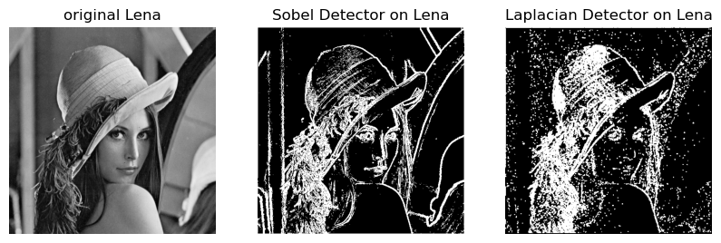
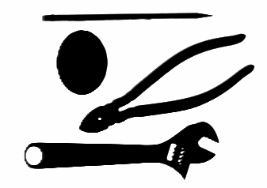
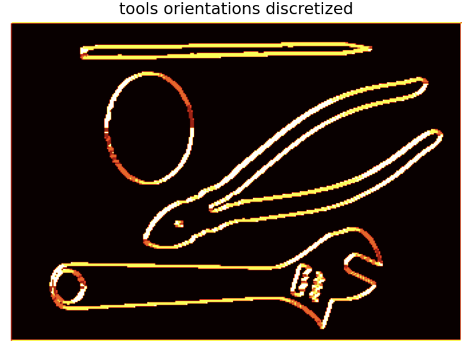

# Edge detection
The goal of this practical work is to experiment with various edge detectors. 

1. In the first part we consider **Sobel filters**. They are filters approximating the gradient of an image. 
Sobel filters belong to the family of **First order detectors**, which work on the approximation of the gradient of the image. 
2. Then, **Laplacian filters** are considered. They approximate the second derivative of an image and belong to the family of **Seconf order detectors**.  

As we can observe from the output here, both Detectors aim to highlight the edges of the image, putting to higher contrast the "skeleton" of an image. 

The second part of the project works on **non maximum suppression**
The exercise addresses the problem of unique localization of edges from a map determined by first order filter. This can be obtained by applying a non maximum suppression technique. 

  
 

 Finally, we study the combination of both, with *smoothing* and *edge detection*, to enhance the analysis of the latter. 

