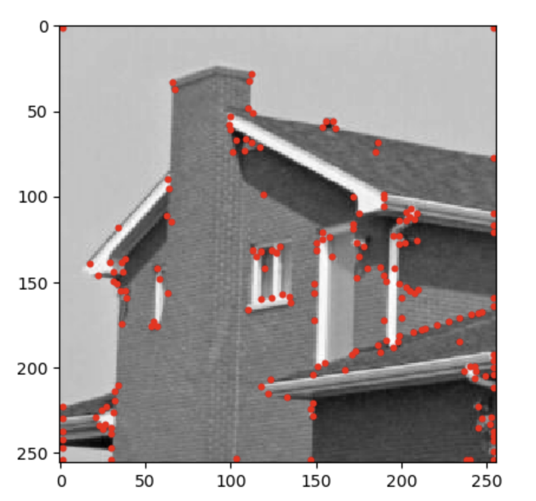
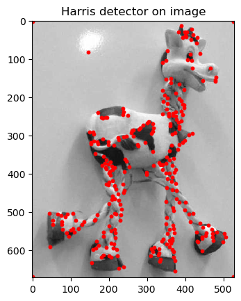
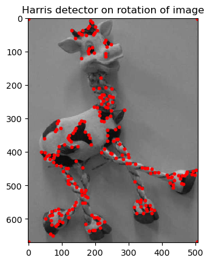

# Harris Corner Detector
The goal of this practical work is to implement the Harris-Stephen's corners detectors. 

The Harris-Stephens corner detector is a feature detection method used in computer vision to identify the corners of an image. 
It computes a "corner response" matrix for each pixel based on the changes in intensity within a small window around the pixel, analyzing gradients in all directions. Corners are identified where the response function indicates significant intensity variation in two perpendicular directions. 

This method is robust to noiose and rotation-invariant, making it widely used for object recognition and tracking. It employs an eigenvalue analysis of the second-moment matrix to determine the presence of edges. 

Here two output results in corner detection of the outside of a house, and a giraffe rotated (to show practically the invariance to rotation of this detector). 

 

|        |            |
|-------------|----------------|
|  | |