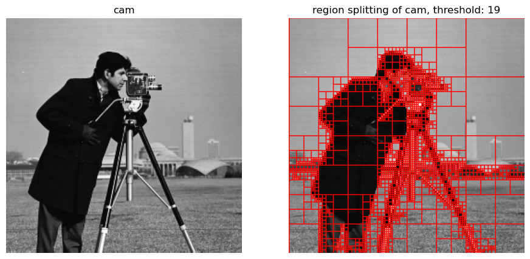
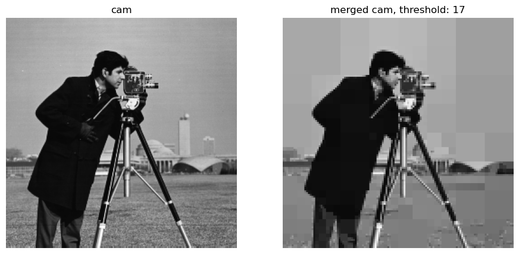

# Split and Merge
In this practical work we implement and test the **split and merge** algorithm. 

The split-and-merge algorithm is a region-based image segmentation method that divides an image into homogeneous regions. It begins by splitting the entire image into smaller subregions if they fail a uniformity criterion (e.g. intensity or texture similarity). 

Merging is then applied to neighboring regions that meet said uniformity criterion to form larger, coherent regions. 

This process iterates, alterning between splitting and merging until no further changes are needed. 

Here an example of image segmentation and reconstruction based off the segmented image. 

