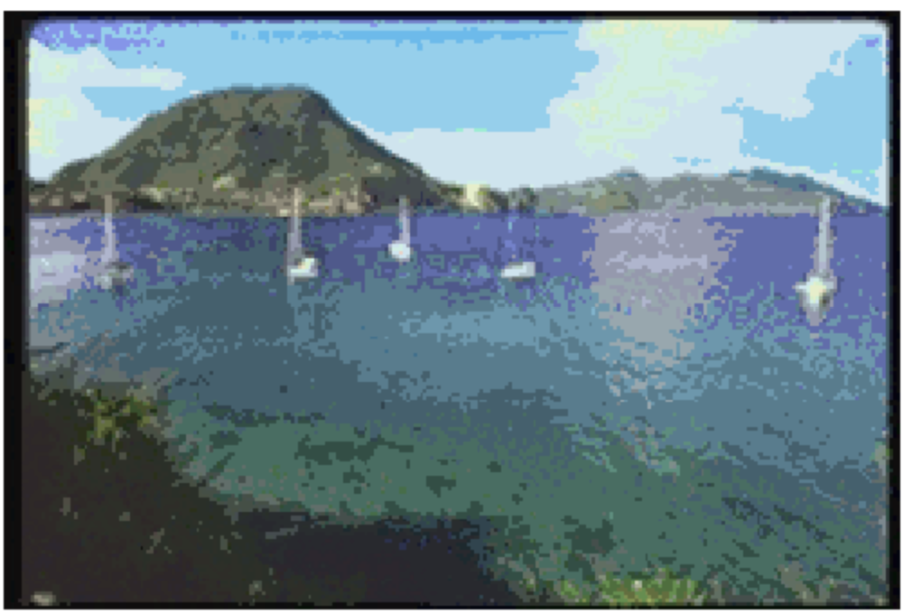
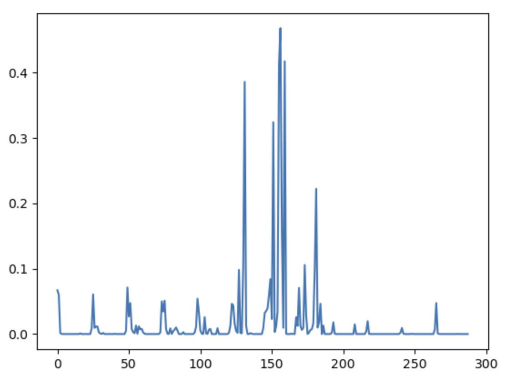
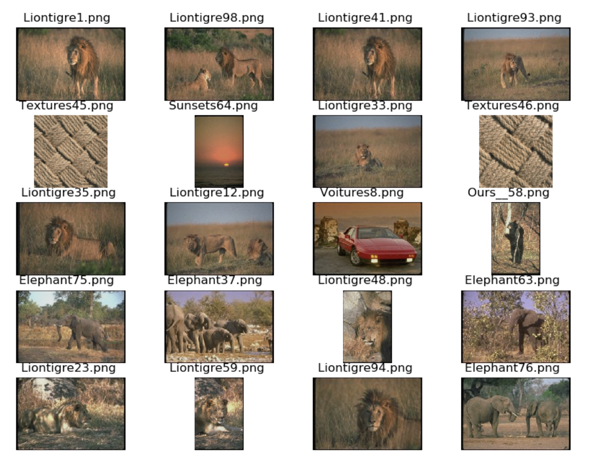

# Color quantification and search by content
In this practical work, we develop a color based descriptor and then use it to find images the most similar to a color query. 

In order to create a color descriptor we use an HSV histogram (Hue, Saturation, Value). This is used rather than  RGB because HSV aligns better with human color perception. 
Unlike RGB, where similar-looking colors might have very different values, HSV ensures that colors appearing similar to the human eye have closer vector representation.

An example of the HSV histogram represantion is the following.
|                       |             |             |               |
|-----------------------|-------------|-------------|---------------|
| | |
 |  |

Creating this HSV dictionary for a database of images, we can then query it for images belonging to the same "color palette" or query images similar to a new image we input in the database using a **similarity matrix**.

Here an example displaying the best 20 matches to an image (the first one displayed on the top left). 

